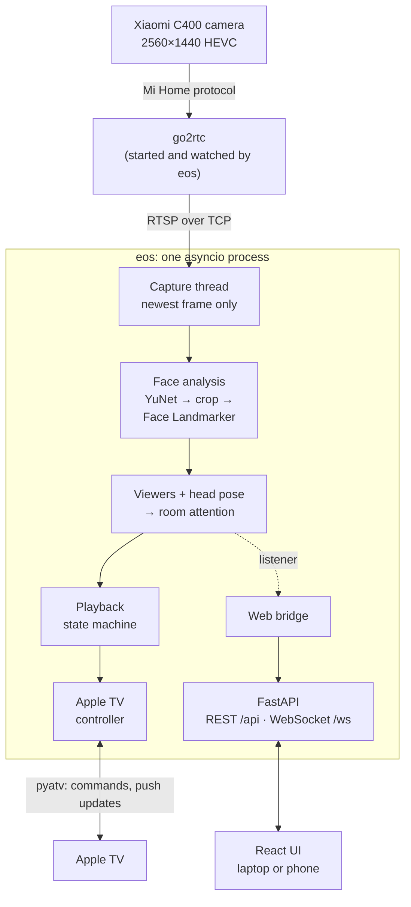
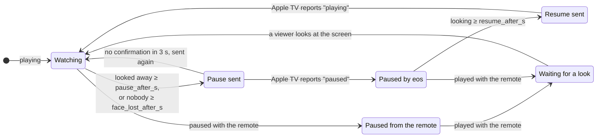

# eyes-on-screen

[](https://github.com/MrDenzzz/eyes-on-screen/actions/workflows/ci.yml)

Pauses the Apple TV when you look away from the screen, and resumes when you look back.

A camera in the living room watches the sofa. When the viewer turns to a phone, a
person or the kitchen, playback pauses after a moment. When they look back at the TV,
it resumes. A pause made with the remote is never touched, and everything runs locally
on one PC.

**Stack:**
- Backend: Python 3.12, asyncio, FastAPI, pydantic v2.
- Vision: OpenCV (YuNet) and MediaPipe Face Landmarker.
- Apple TV: pyatv.
- Frontend: React 19, TypeScript, Vite, zustand, Vitest.
- CI: GitHub Actions, including end-to-end tests on the real face models.

## What it does

- **Pauses** playback once the viewers have looked away for `pause_after_s`, or once
  nobody has been on the sofa for `face_lost_after_s`.
- **Resumes only its own pauses**, once a viewer has looked back for `resume_after_s`.
  A pause from the remote stays a pause.
- **Respects a deliberate play.** If someone starts playback themselves (from the
  kitchen, say), nothing is paused until a viewer is seen looking at the screen.
- **Several viewers:** pause when anyone looks away (`any_away`, default), only when
  everyone does (`all_away`), or follow the person nearest to the TV (`nearest`).
- **Ignores face-like decor.** A printed cat on a sofa pillow is never a viewer: a face
  counts only if real face landmarks were found at that spot.
- **Has a web UI**, in English and Russian, that works from a phone:
  - live video with the viewing zone and a gaze arrow per viewer;
  - an attention timeline with pause and resume markers;
  - player controls and an events feed;
  - settings that are saved back to `config.yaml` with its comments kept;
  - calibration;
  - a guided recording for tuning thresholds (see below).

## How it works



**Video.** The camera has no RTSP output, so [go2rtc](https://github.com/AlexxIT/go2rtc)
re-publishes its stream locally (setup in [docs/go2rtc.md](docs/go2rtc.md)). eos starts
go2rtc, watches it, and restarts it if it dies. A background thread reads the stream
and keeps only the newest frame. A queue would turn into seconds of lag, and the pause
would come long after the viewer looked away. Two decoder quirks are handled there:
- after a reconnect, the decoder emits flat grey frames until the next HEVC key frame,
  and these are skipped;
- after a dead stream, OpenCV hands out frames still buffered in the decoder, stamped as
  new. They are detected and the stream is reopened.

**Faces.** At sofa distance a face is only ~44 px wide in a 2560×1440 frame.
MediaPipe's own detector works on a downscaled image and found nothing at that size.
So the work is split into two stages:
1. YuNet scans the viewing zone at full resolution.
2. Each face is cut out as a square crop, upscaled to 256 px and passed to MediaPipe Face
   Landmarker. Its transformation matrix gives the head's yaw and pitch relative to the
   line from the face to the camera.

**Attention.** A face looks at the screen when its pose is within the tolerances of the
calibrated screen direction. Per-face results are combined into one value for the room
(looking, away or nobody), following the several-viewers mode. That value goes into the
state machine.

**The app core knows nothing about the web.** `App` runs the pipeline and exposes
operations: settings, calibration, recording and player buttons. The web bridge
subscribes as a listener and turns REST calls into those operations. The Apple TV is
passed in behind a `Player` protocol, so:
- tests drive the whole pipeline with a fake player;
- `eos run` works in watch-only mode before an Apple TV is paired.

**One typed protocol.** Every message between the server and the page is a pydantic
model. FastAPI validates and documents them (OpenAPI at `/api/docs`). Their JSON Schema
generates the TypeScript types, and CI fails when the two drift apart. Events carry a
code and values, so the page phrases them in the viewer's language while
`logs/events.log` stays in English.

### The pause logic



The state machine ([attention/state_machine.py](src/eyes_on_screen/attention/state_machine.py))
takes the current time as an argument, so its tests run on a fake clock. It also:
- sends nothing while the Apple TV is disconnected;
- restarts its timers after a gap in the video, so a stalled stream does not count as
  "looked away".

## In numbers

Measured at home: Ryzen 9800X3D, CPU only, Xiaomi C400 about 4 m from the sofa.

| What | Value |
|---|---|
| Camera stream | 2560×1440 HEVC, ~20 fps |
| Analysis rate | 10 frames/s (configurable) |
| Analysis time per frame | ~9 ms with nobody there, +~5 ms per face |
| Face width at the sofa | ~44 px |
| Apple TV confirms a pause (push update) | ~0.8 s after the command |
| Lost stream detected and reopened | within 3 s |
| Grey frames skipped after a reconnect (3 s GOP) | ~60 |
| Tests | 198 Python, including end-to-end on the real models; 34 frontend |

## Tuning from data

The first live test found a gap: looking at a phone did not pause. The guess was that
only the eyes move, so the **Record** tab was built:
- it walks a viewer through scripted steps: watch the TV, phone in hands, phone on lap,
  look around, eyes closed;
- each step starts with a countdown and a beep and ends with a double beep;
- every analysed frame is saved as a labelled CSV row, with no images.

One 5-minute session gave a different answer:

| Step | Head pitch (median) |
|---|---|
| Watching the TV | +24° (5th–95th percentile: +16…+36°) |
| Phone in hands | +5° |
| Phone on lap | −6° |

- **The head does move**, by 20–30°.
- **The eyes do not separate the cases.** The "eyes looking down" score was 0.72 on the
  TV and 0.75 on the phone, and eyes-closed was unreliable on 44 px faces.
- **The real cause was a stale calibration.** It was made in a different posture, ~20°
  away from this one.

With the centre taken from the recording's "screen" steps, replaying the session gives:
- the phone reads as "away" in 93–100% of frames;
- the longest false "away" while watching is 0.4 s, under the 0.8 s pause delay.

## Getting started

eos was built on Windows 11 and is tested on Linux in CI. You need:
- [uv](https://docs.astral.sh/uv/) (it installs Python 3.12 itself);
- an Apple TV on tvOS 15 or newer;
- a camera: the Xiaomi C400 via go2rtc, any RTSP stream, a webcam, or a video file.

```shell
uv sync
copy config.example.yaml config.yaml    # then set the camera and the viewing zone
uv run eos download-models              # YuNet + Face Landmarker, SHA-256 verified
uv run eos atv scan                     # find the Apple TV, put its id into config.yaml
uv run eos atv pair                     # PINs appear on the TV; credentials go to data/
uv run eos run                          # web UI at http://127.0.0.1:8765
```

Then, in the web UI:
1. Press **Zone** and drag over the sofa.
2. Sit down, press **Calibrate** and look at the screen for the countdown.

`uv run eos run --dry-run` only logs what it would pause or resume.

To open the UI from a laptop or a phone, set `web.host: 0.0.0.0` and a `web.password`.
The page shows a live camera, so eos refuses to listen on the network without a password.

### Main settings

| Key | Default | Meaning |
|---|---|---|
| `video.source` | `rtsp` | `rtsp`, `webcam` or `file` (a recording played in a loop) |
| `target.roi` | whole frame | Viewing zone, `[x1, y1, x2, y2]` in 0…1 |
| `pose.*_center_deg`, `pose.*_tolerance_deg` | 0 / 20, 15 | Screen direction (set by calibration) and how far from it still counts as looking |
| `behavior.pause_after_s` / `resume_after_s` | 1.5 / 0.5 | How long a look away or back must last |
| `behavior.on_face_lost` | `pause` | Also pause when nobody is there (after `face_lost_after_s`) |
| `behavior.multiple_viewers` | `any_away` | `any_away`, `all_away` or `nearest` |
| `go2rtc.autostart` | `false` | Start and supervise go2rtc together with eos |

[config.example.yaml](config.example.yaml) documents every key. `eos config-check`
prints the effective values.

## Development

```shell
uv run pytest && uv run ruff check && uv run ruff format --check
cd frontend
npm ci
npm run dev     # hot-reloading UI on :5173, proxied to a running `eos run`
npm test        # Vitest + Testing Library
npm run gen     # after changing web/messages.py: JSON Schema → TypeScript types
npm run build   # the UI served by eos; the build is committed, so eos needs no Node.js
```

The tests come at three levels:
- **Unit tests** cover the state machine, viewers, calibration, config, capture,
  go2rtc supervision, pyatv glue and settings round-trips. They use fake time and fake
  captures.
- **Pipeline tests** run `App` end to end with a fake camera, a fake face detector and a
  fake player: look away → pause, look back → resume, leave → pause.
- **End-to-end tests** feed a generated video through the real models. The video uses
  a public-domain portrait: as painted, the head is turned ~20° one way, and mirrored it
  reads as the same head turned ~40° from that. The test checks that eos pauses on the
  mirrored face, resumes on the original, and pauses when the face disappears. CI
  downloads the models for this.

```
src/eyes_on_screen/
  app.py              the pipeline and its operations (no web, no pyatv imports)
  video/              capture thread, file playback, go2rtc supervisor
  vision/             YuNet + Face Landmarker, head pose, model downloads
  attention/          classifier, viewers, calibration, playback state machine
  appletv/            Player protocol, pyatv controller, pairing
  web/                FastAPI server, App ↔ web bridge, messages, events
  recording.py        guided and labelled recordings
frontend/src/         React app: components, canvas drawing, i18n, typed protocol
tests/                unit, pipeline and end-to-end tests
```

## Privacy

- Video is analysed in memory and never stored. Recordings keep only numbers.
- Nothing leaves the home network except go2rtc's connection to Mi Home, which it uses
  to fetch the camera's keys.
- Credentials stay out of the repository: `config.yaml`, `data/` (Apple TV pairing) and
  `go2rtc/go2rtc.yaml` (Mi Home token) are git-ignored.

## Known limits

- **One calibration fits one posture.** Sitting up and lying back differ by ~20°, so
  after moving to another spot, press Calibrate again.
- **Night mode with the camera's IR light is not measured yet.**
- **It controls one Apple TV.**
