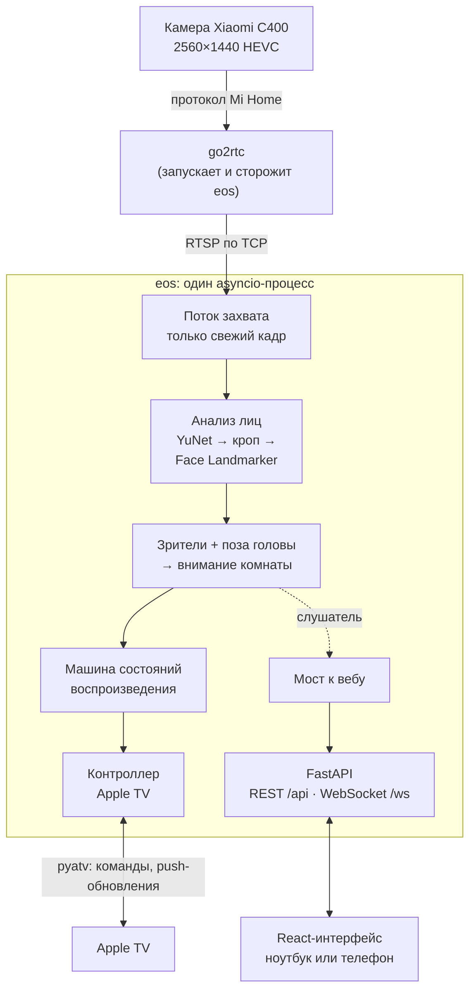
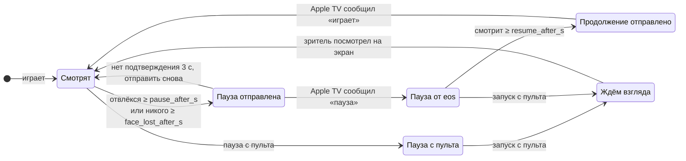

# eyes-on-screen

[English](README.md) | **Русский**

[](https://github.com/MrDenzzz/eyes-on-screen/actions/workflows/ci.yml)

Ставит Apple TV на паузу, когда вы отводите взгляд от экрана, и продолжает
воспроизведение, когда смотрите обратно.

Камера в гостиной смотрит на диван. Если зритель отвернулся к телефону, к собеседнику
или ушёл на кухню, через мгновение видео встаёт на паузу. Посмотрел обратно на ТВ —
воспроизведение продолжается. Паузу, поставленную с пульта, приложение не трогает. Всё
работает локально на одном ПК.

**Стек:**
- Бэкенд: Python 3.12, asyncio, FastAPI, pydantic v2.
- Компьютерное зрение: OpenCV (YuNet) и MediaPipe Face Landmarker.
- Apple TV: pyatv.
- Фронтенд: React 19, TypeScript, Vite, zustand, Vitest.
- CI: GitHub Actions, включая сквозные тесты на настоящих моделях.

## Что умеет

- **Ставит на паузу**, когда зрители отвлеклись дольше `pause_after_s` или на диване
  никого нет дольше `face_lost_after_s`.
- **Снимает с паузы только свои паузы**, когда зритель смотрит на экран дольше
  `resume_after_s`. Пауза с пульта так и остаётся паузой.
- **Уважает осознанный запуск.** Если кто-то включил воспроизведение сам (например, с
  кухни), ничего не ставится на паузу, пока камера не увидит, что зритель смотрит на экран.
- **Несколько зрителей:** пауза, когда отвлёкся хоть один (`any_away`, по умолчанию),
  только когда отвлеклись все (`all_away`), или следить за ближайшим к ТВ (`nearest`).
- **Не путает лица с декором.** Нарисованный кот на подушке никогда не считается
  зрителем: лицо засчитывается, только если в этом месте нашлись настоящие точки лица.
- **Есть веб-интерфейс** на русском и английском, работает с телефона:
  - живое видео с зоной просмотра и стрелкой взгляда для каждого зрителя;
  - шкала внимания с отметками пауз и продолжений;
  - управление плеером и лента событий;
  - настройки, которые сохраняются обратно в `config.yaml` вместе с комментариями;
  - калибровка;
  - пошаговая запись для подбора порогов (см. ниже).

## Как устроено



**Видео.** У камеры нет выхода RTSP, поэтому [go2rtc](https://github.com/AlexxIT/go2rtc)
перепубликует её поток локально (настройка в [docs/go2rtc.md](docs/go2rtc.md)). eos сам
запускает go2rtc, следит за ним и перезапускает, если тот упал. Фоновый поток читает
видео и держит только самый свежий кадр. Очередь превратилась бы в секунды задержки, и
пауза наступала бы намного позже, чем зритель отвернулся. Там же обработаны две
особенности декодера:
- после переподключения декодер выдаёт ровные серые кадры до следующего ключевого кадра
  HEVC, их пропускаем;
- после обрыва потока OpenCV отдаёт кадры, застрявшие в буфере декодера, с новыми
  отметками времени. Их распознаём и открываем поток заново.

**Лица.** С дивана лицо занимает всего ~44 px в ширину на кадре 2560×1440. Встроенный
детектор MediaPipe работает на уменьшенной картинке и при таком размере не находил
ничего. Поэтому работа разбита на два этапа:
1. YuNet ищет лица в зоне просмотра в полном разрешении.
2. Каждое лицо вырезается квадратом, увеличивается до 256 px и уходит в MediaPipe Face
   Landmarker. Его матрица преобразования даёт поворот и наклон головы относительно линии
   от лица до камеры.

**Внимание.** Лицо смотрит на экран, если его поза укладывается в допуски вокруг
откалиброванного направления на экран. Результаты по всем лицам сводятся в одно значение
для комнаты (смотрит, отвлёкся или никого) по выбранному режиму для нескольких
зрителей. Это значение и уходит в машину состояний.

**Ядро приложения ничего не знает о вебе.** `App` гоняет конвейер и даёт операции:
настройки, калибровка, запись, кнопки плеера. Мост к вебу подписывается на него как
слушатель и превращает REST-вызовы в эти операции. Apple TV передаётся снаружи через
протокол `Player`, поэтому:
- тесты гоняют весь конвейер с фейковым плеером;
- `eos run` работает в режиме «только наблюдение», пока Apple TV не подключён.

**Один типизированный протокол.** Каждое сообщение между сервером и страницей — модель
pydantic. FastAPI проверяет и документирует их (OpenAPI на `/api/docs`). Из их JSON Schema
генерируются типы TypeScript, и CI падает, если они разошлись. События несут код и
значения, поэтому страница формулирует их на языке зрителя, а `logs/events.log` остаётся
на английском.

### Логика паузы



Машина состояний ([attention/state_machine.py](src/eyes_on_screen/attention/state_machine.py))
получает текущее время аргументом, поэтому её тесты идут на фейковых часах. Кроме того,
она:
- ничего не отправляет, пока Apple TV отключён;
- сбрасывает таймеры после перерыва в видео, чтобы зависший поток не засчитывался как
  «отвлёкся».

## В цифрах

Замерено дома: Ryzen 9800X3D, только CPU, Xiaomi C400 примерно в 4 м от дивана.

| Что | Значение |
|---|---|
| Поток камеры | 2560×1440 HEVC, ~20 к/с |
| Частота анализа | 10 кадров/с (настраивается) |
| Время анализа кадра | ~9 мс без людей, +~5 мс на каждое лицо |
| Ширина лица с дивана | ~44 px |
| Apple TV подтверждает паузу (push-обновление) | ~0,8 с после команды |
| Обрыв потока замечен и поток переоткрыт | за 3 с |
| Серых кадров пропускается после переподключения (GOP 3 с) | ~60 |
| Тесты | 198 на Python, включая сквозные на настоящих моделях; 34 на фронте |

## Настройка по данным

Первый живой тест нашёл пробел: взгляд в телефон не ставил паузу. Предположили, что
двигаются только глаза, и сделали вкладку **«Запись»**:
- она проводит зрителя по шагам: смотреть ТВ, телефон в руках, телефон на коленях,
  смотреть по сторонам, закрыть глаза;
- каждый шаг начинается с отсчёта и сигнала и заканчивается двойным сигналом;
- каждый проанализированный кадр сохраняется строкой CSV с меткой шага, без изображений.

Одна пятиминутная сессия дала другой ответ:

| Шаг | Наклон головы (медиана) |
|---|---|
| Смотрит ТВ | +24° (5–95-й процентиль: +16…+36°) |
| Телефон в руках | +5° |
| Телефон на коленях | −6° |

- **Голова двигается**, на 20–30°.
- **По глазам случаи не различить.** Оценка «взгляд вниз» была 0,72 на ТВ и 0,75 на
  телефоне, а закрытые глаза на лицах в 44 px распознавались ненадёжно.
- **Настоящая причина — устаревшая калибровка.** Её сделали в другой позе, на ~20° в
  стороне от этой.

Если взять центр из шагов «смотрит на экран», та же сессия даёт:
- телефон читается как «отвлёкся» в 93–100% кадров;
- самый длинный ложный «отвлёкся» во время просмотра — 0,4 с, меньше задержки паузы 0,8 с.

## Как запустить

eos написан на Windows 11 и проверяется на Linux в CI. Нужны:
- [uv](https://docs.astral.sh/uv/) (Python 3.12 он поставит сам);
- Apple TV с tvOS 15 или новее;
- камера: Xiaomi C400 через go2rtc, любой RTSP-поток, веб-камера или видеофайл.

```shell
uv sync
copy config.example.yaml config.yaml    # затем указать камеру и зону просмотра
uv run eos download-models              # YuNet + Face Landmarker, с проверкой SHA-256
uv run eos atv scan                     # найти Apple TV, вписать его id в config.yaml
uv run eos atv pair                     # PIN-коды появятся на ТВ; ключи лягут в data/
uv run eos run                          # веб-интерфейс на http://127.0.0.1:8765
```

Дальше в веб-интерфейсе:
1. Нажмите **«Зона»** и обведите диван.
2. Сядьте, нажмите **«Калибровка»** и смотрите на экран во время отсчёта.

`uv run eos run --dry-run` только пишет в лог, что поставил бы на паузу или продолжил.

Чтобы открыть интерфейс с ноутбука или телефона, задайте `web.host: 0.0.0.0` и
`web.password`. На странице живое видео с камеры, поэтому без пароля eos в сеть не
выходит.

### Основные настройки

| Ключ | По умолчанию | Смысл |
|---|---|---|
| `video.source` | `rtsp` | `rtsp`, `webcam` или `file` (запись по кругу) |
| `target.roi` | весь кадр | Зона просмотра, `[x1, y1, x2, y2]` в долях от 0 до 1 |
| `pose.*_center_deg`, `pose.*_tolerance_deg` | 0 / 20, 15 | Направление на экран (задаётся калибровкой) и насколько можно от него отклониться |
| `behavior.pause_after_s` / `resume_after_s` | 1,5 / 0,5 | Сколько должен длиться взгляд в сторону или обратно |
| `behavior.on_face_lost` | `pause` | Ставить на паузу и когда никого нет (через `face_lost_after_s`) |
| `behavior.multiple_viewers` | `any_away` | `any_away`, `all_away` или `nearest` |
| `go2rtc.autostart` | `false` | Запускать go2rtc вместе с eos и следить за ним |

В [config.example.yaml](config.example.yaml) описан каждый ключ. `eos config-check`
печатает итоговые значения.

## Разработка

```shell
uv run pytest && uv run ruff check && uv run ruff format --check
cd frontend
npm ci
npm run dev     # интерфейс с горячей перезагрузкой на :5173, проксируется в запущенный `eos run`
npm test        # Vitest + Testing Library
npm run gen     # после изменения web/messages.py: JSON Schema → типы TypeScript
npm run build   # интерфейс, который отдаёт eos; сборка в репозитории, так что Node.js для eos не нужен
```

Тесты трёх уровней:
- **Модульные** покрывают машину состояний, зрителей, калибровку, конфиг, захват видео,
  надзор за go2rtc, обвязку pyatv и сохранение настроек. Используют фейковое время и
  фейковый захват.
- **Тесты конвейера** гоняют `App` целиком с фейковой камерой, фейковым детектором лиц и
  фейковым плеером: отвернулся → пауза, посмотрел → продолжение, ушёл → пауза.
- **Сквозные** пропускают сгенерированное видео через настоящие модели. В видео —
  портрет из общественного достояния: на картине голова повёрнута на ~20° в одну сторону,
  а в зеркальном отражении читается как та же голова, повёрнутая на ~40° от исходного
  положения. Тест проверяет, что eos ставит паузу на отражении, продолжает на оригинале и
  ставит паузу, когда лицо исчезает. CI для этого скачивает модели.

```
src/eyes_on_screen/
  app.py              конвейер и его операции (без веба и без импортов pyatv)
  video/              поток захвата, проигрывание файла, надзор за go2rtc
  vision/             YuNet + Face Landmarker, поза головы, загрузка моделей
  attention/          классификатор, зрители, калибровка, машина состояний
  appletv/            протокол Player, контроллер pyatv, сопряжение
  web/                сервер FastAPI, мост App ↔ веб, сообщения, события
  recording.py        пошаговые записи с метками
frontend/src/         React-приложение: компоненты, отрисовка на canvas, i18n, типизированный протокол
tests/                модульные, конвейерные и сквозные тесты
```

## Приватность

- Видео анализируется в памяти и нигде не сохраняется. В записях только числа.
- Из домашней сети ничего не уходит, кроме соединения go2rtc с Mi Home, через которое он
  получает ключи камеры.
- Учётные данные в репозиторий не попадают: `config.yaml`, `data/` (ключи Apple TV) и
  `go2rtc/go2rtc.yaml` (токен Mi Home) в `.gitignore`.

## Известные ограничения

- **Одна калибровка — одна поза.** Сидя и полулёжа направление отличается на ~20°, так
  что после пересадки нажмите «Калибровка» ещё раз.
- **Ночной режим с ИК-подсветкой камеры ещё не замерен.**
- **Управляет одним Apple TV.**
